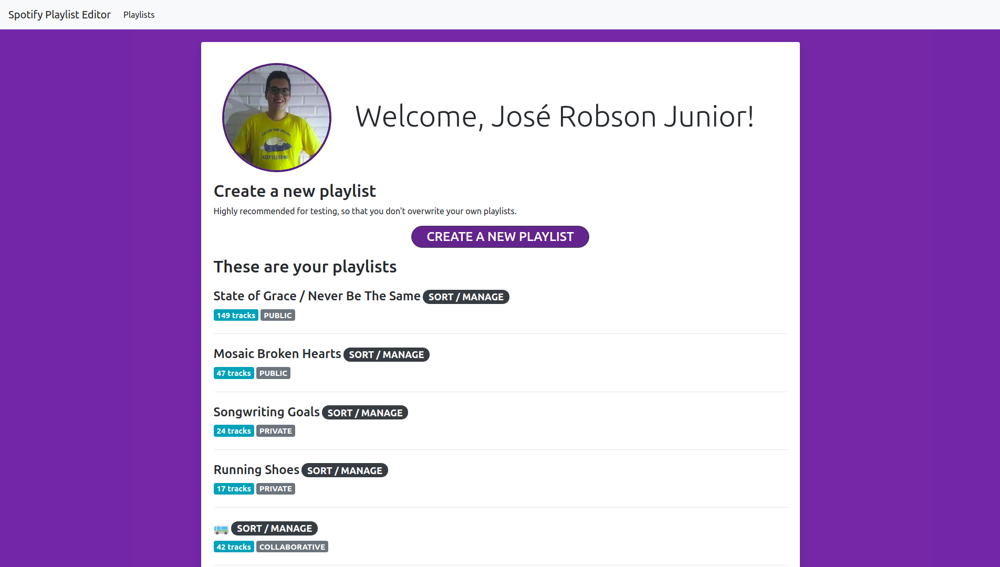

# Spotify Playlist Editor

Sort your Spotify playlists anyway you want! 🛠

## Table of Contents

-   [Features](#features)
-   [Community](#community)
    -   [Installation and Usage](#installation-and-usage)
    -   [Deployment](#deployment)
    -   [Suggest a new feature or report a bug](#suggest-a-new-feature-or-report-a-bug)
    -   [Maintainers](#maintainers)

## Features

- Create new playlists out of your recent Spotify tracks or your all-time top tracks;
- Sort playlists based on:
    - playlist track attributes (addition date);
    - track attributes (name, length, popularity);
    - album attributes (name, release date);
    - artist attributes (name).

### Current limitations

- It's highly recommended to create a copy of the playlists you want to edit or to use one of the playlist creation options. (play around, but do it safely!);
- You can only sort playlists with 100 tracks or less;
- Sorting might take a while (a playlist with 100 tracks can take between 30 seconds and 1 minute). Do NOT reload or close the playlist page until sorting is over.

## Community

### Installation and Usage

Simply run `yarn install` to install the project's dependencies and then run `yarn start` to run it in development mode. Alternatively, if you'd rather just try the application out, it is currently [deployed to GitHub Pages](https://calluswhatyouwant.github.io/spotify-playlist-editor).

### Deployment

To deploy the application to GitHub pages, run `yarn deploy`.

### Suggest a new feature or report a bug

Note that we have [issue templates](.github/ISSUE_TEMPLATE).

### Maintainers

[@JRobsonJr](http://github.com/JRobsonJr)